# Smart Customer Support Dashboard: Real-Time + Lakehouse Analytics Workshop

## Querying Iceberg and Cassandra Together with Presto using watsonx.data + AstraDB

[](https://opensource.org/licenses/MIT)
[](https://www.ibm.com/watsonx)
[](https://astra.datastax.com)

---

## 📖 Overview

Modern data architectures often split workloads across:

* **Lakehouse systems** (Iceberg) → for large-scale historical analytics
* **Operational databases** (Cassandra) → for real-time, low-latency data

This workshop demonstrates how to **combine both worlds in a single query** using Presto in the IBM TechZone watsonx.data environment.

### 💡 What You Will Learn

* Query historical data from **Apache Iceberg** tables
* Query real-time data from **Cassandra (AstraDB)**
* Run **federated queries across both systems** seamlessly
* Build a foundation for real-time analytics and GenAI use cases
* Understand lakehouse architecture patterns

### ⏱️ Workshop Duration
**Estimated Time:** 2-3 hours (hands-on)

---

## 🎯 Use Case: Smart Customer Support Dashboard

**Business Scenario:**

A customer support agent needs a complete view of a customer to provide personalized service:

* **Customer Lifetime Value** (historical data from Iceberg)
* **Current Activity** (real-time session data from Cassandra)
* **Latest Transaction Status** (real-time from Cassandra)

**Traditional Approach Problems:**
- ❌ Build complex ETL pipelines
- ❌ Duplicate data across systems
- ❌ Data freshness issues
- ❌ High maintenance overhead

**Our Solution:**
- ✅ Query everything **in-place** with Presto
- ✅ No data movement or duplication
- ✅ Real-time + historical insights
- ✅ Single SQL interface

---

## 🏗️ Architecture

```
┌─────────────────────────────────────────────────────────────────┐
│                    watsonx.data Platform                        │
│                                                                 │
│  ┌───────────────────────────────────────────────────────────┐  │
│  │                  Presto Query Engine                      │  │
│  │         (Unified SQL Interface for Federation)            │  │
│  └──────────────┬─────────────────────┬──────────────────────┘  │
│                 │                     │                         │
│     ┌───────────▼──────────┐          │                         │
│     │ Cassandra Connector  │          │                         │
│     │  (    CQL Proxy)     │          │                         │
│     └───────────┬──────────┘          │                         │
└─────────────────┼─────────────────────┼─────────────────────────┘
                  │                     │
         ┌────────▼────────┐  ┌─────────▼─────────┐
         │    AstraDB      │  │  MinIO/S3         │
         │  (Cassandra)    │  │  (Object Storage) │
         │                 │  │                   │
         │ • Sessions      │  │ • Customers       │
         │ • Transactions  │  │ • Orders          │
         │ • Events        │  │ • Analytics       │
         │                 │  │                   │
         │ Real-Time Data  │  │ Historical Data   │
         └─────────────────┘  └───────────────────┘
              (ms latency)        (PB scale)
```

### Component Roles

| Component | Purpose | Optimized For |
|-----------|---------|---------------|
| **Presto** | Distributed SQL query engine | Federated queries, JOIN operations |
| **Cassandra (AstraDB)** | NoSQL operational database | High-throughput writes, low-latency reads |
| **Iceberg** | Table format for data lakes | Large-scale analytics, ACID transactions |
| **watsonx.data** | Unified data platform | Governance, catalog, query optimization |

---

## 📋 Prerequisites

### Required Accounts
- ✅ **IBM TechZone Account** (for watsonx.data environment)
- ✅ **DataStax Astra Account** (free tier available)
- ✅ **GitHub Account** (optional, for cloning repo)

### Required Knowledge
- Basic SQL (SELECT, JOIN, GROUP BY)
- Understanding of databases (relational and NoSQL concepts)
- Command-line basics (SSH, Docker commands)
- Basic understanding of cloud services

### Tools Needed
- Terminal/Command Prompt
- SSH client
- Web browser (Chrome/Firefox recommended)
- Text editor (VS Code, Sublime, etc.)

---

## 🚀 Setup Instructions

### Step 1: Provision watsonx.data Environment (IBM TechZone)

This workshop uses the **watsonx.data v2.2.0 Developer Edition** from IBM TechZone. This environment is available to IBM employees and IBM Business Partners, and is not available to the public.

#### 1.1 Create Reservation

1. Navigate to the [IBM watsonx.data Developer Base Image](https://techzone.ibm.com/collection/ibm-watsonxdata-developer-base-image) collection

    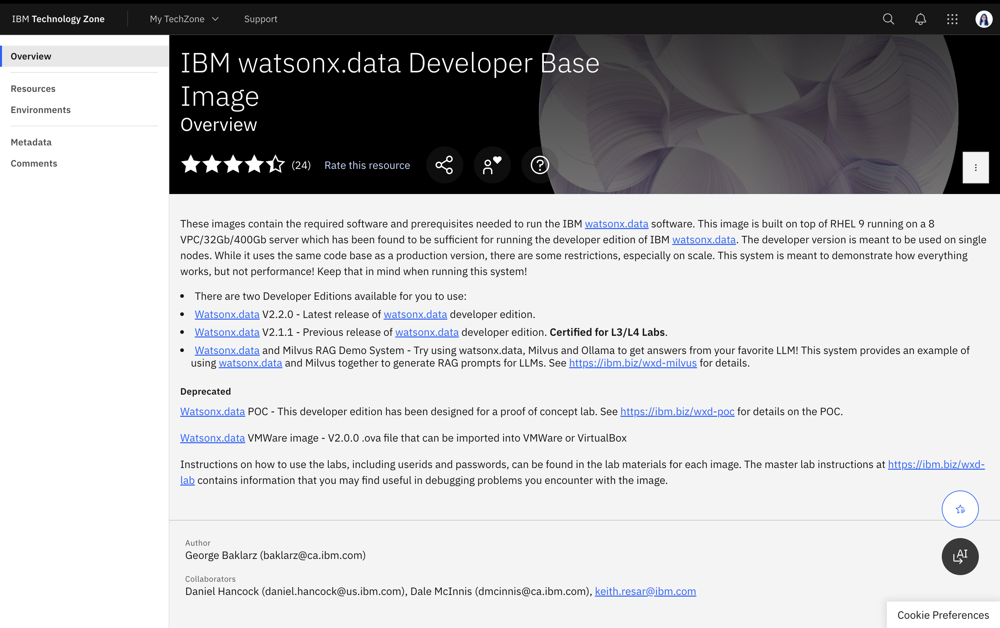 

2. Sign in with your IBMid and accept terms and conditions
3. Select the **Environments** tab in the left-side menu
4. Click **IBM Cloud environment** button on the **IBM watsonx.data Development Lab - 2.2.0 GA** tile

   > ⚠️ **Important:** Use version 2.2.0 to ensure compatibility with this workshop

5. Select **Request an environment** radio button
6. Fill in the reservation details:
   - **Name:** Choose a descriptive name (e.g., "Lakehouse Workshop")
   - **Purpose:** Select "Education"
   - **Purpose description:** "Real-time + Lakehouse Analytics Workshop"
   - **Preferred Geography:** Select based on your location
   - **End date:** Adjust as needed

7. On the right panel. Read and accept the Terms & Conditions and End User Security Policies
8. Click **Submit**

    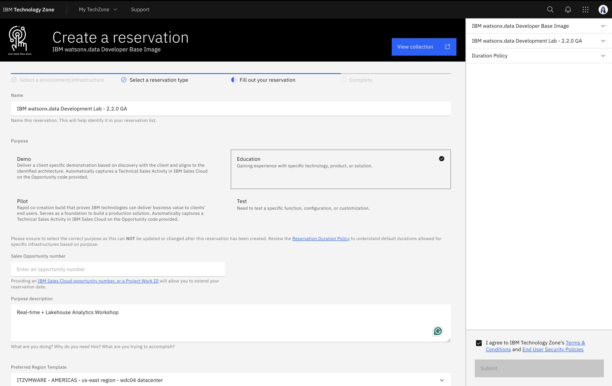

#### 1.2 Wait for Provisioning

- You'll receive an email acknowledging the request
- Provisioning typically takes **15-60 minutes**
- You'll receive another email when provisioning is complete
- Reservation status is available at: https://techzone.ibm.com/my/reservations

#### 1.3 Access Your Environment

- Open the Reservation Ready on IBM Technology Zone email.
- Click the View My Reservations button to view your TechZone reservations (you may have
to login again).
- Open the reservation, it should be in  Status - Ready state.

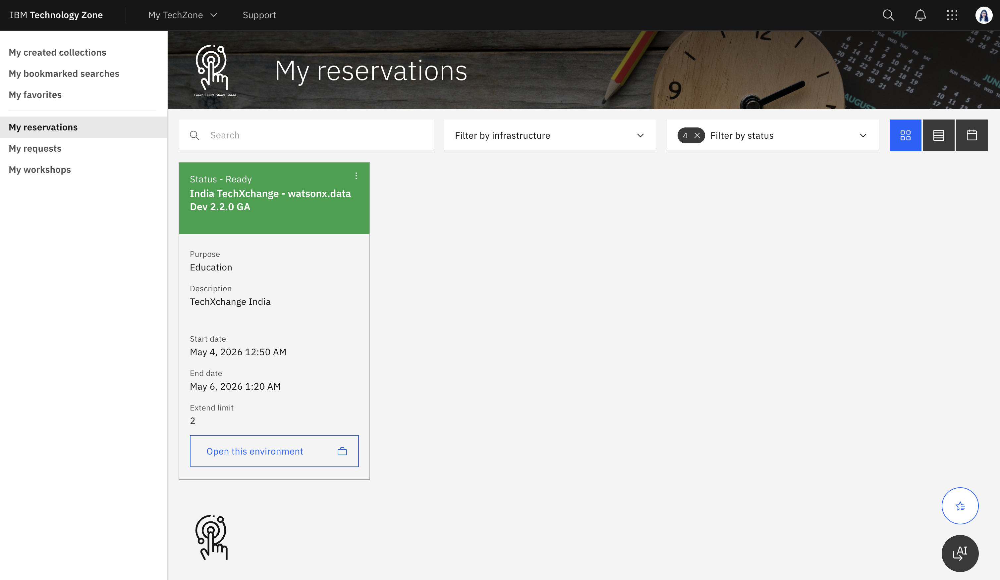

#### 1.4 Pre-configured Components
Under published services, you will see endpoint to access Watsonx.data UI, Presto UI, MinIO Console, SSH access and more.

This environment includes a pre-configured data lake environment with:
- ✅ Presto Query Engine
- ✅ Three catalogs (iceberg_data, hive_data, tpch)
- ✅ Four object storage buckets 
- ✅ Hive Metastore
- ✅ Docker runtime
- ✅ Milvus Service
- ✅ Watsonx.data UI
- ✅ Jupyter Notebook

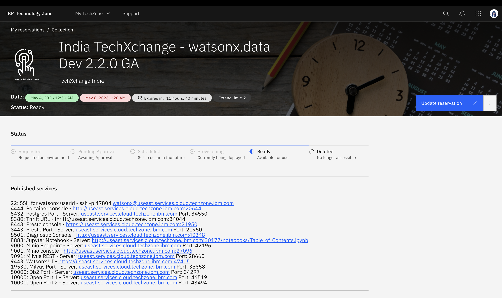

In this workshop, we will only use the Iceberg catalog and the Presto UI.
---

### Step 2: Populate Data in Iceberg Tables

#### 2.1 Access Watsonx UI and create Iceberg Schema

Login into the Watsonx UI at the published endpoint.
  
    🔐  Username: ibmlhadmin

    🔐  Password: password

    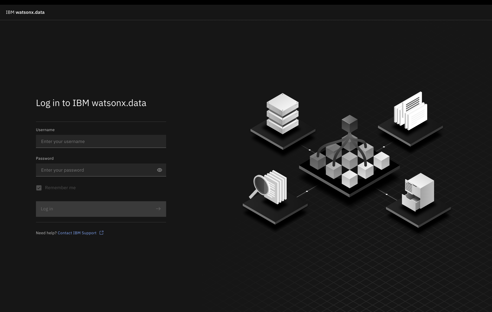

Go to Data Manager and Create Schema named **customers_schema** in the **iceberg_data** catalog.

#### 2.2 Create Iceberg Tables (Historical Data)

1. Go to Data Manager and Create Schema named **customers_schema** in the **iceberg_data** catalog. Or create schema using SQL command.
2. Go to **Query Manager** and Create Iceberg tables as follows:


customers_details : contains customer details like name, email, city, country, signup date, and customer tier.
customers_orders : contains customer orders with order ID, customer ID, product name, amount, order date, and status.

```sql
-- Create customers table in Iceberg
CREATE TABLE iceberg_data.customers_schema.customers_details (
    customer_id VARCHAR,
    name VARCHAR,
    email VARCHAR,
    city VARCHAR,
    country VARCHAR,
    signup_date DATE,
    customer_tier VARCHAR
) WITH (
    format = 'PARQUET'
);

-- Create orders table in Iceberg
CREATE TABLE iceberg_data.customers_schema.customers_orders (
    order_id VARCHAR,
    customer_id VARCHAR,
    product_name VARCHAR,
    amount DOUBLE,
    order_date DATE,
    status VARCHAR
) WITH (
    format = 'PARQUET'
);
```

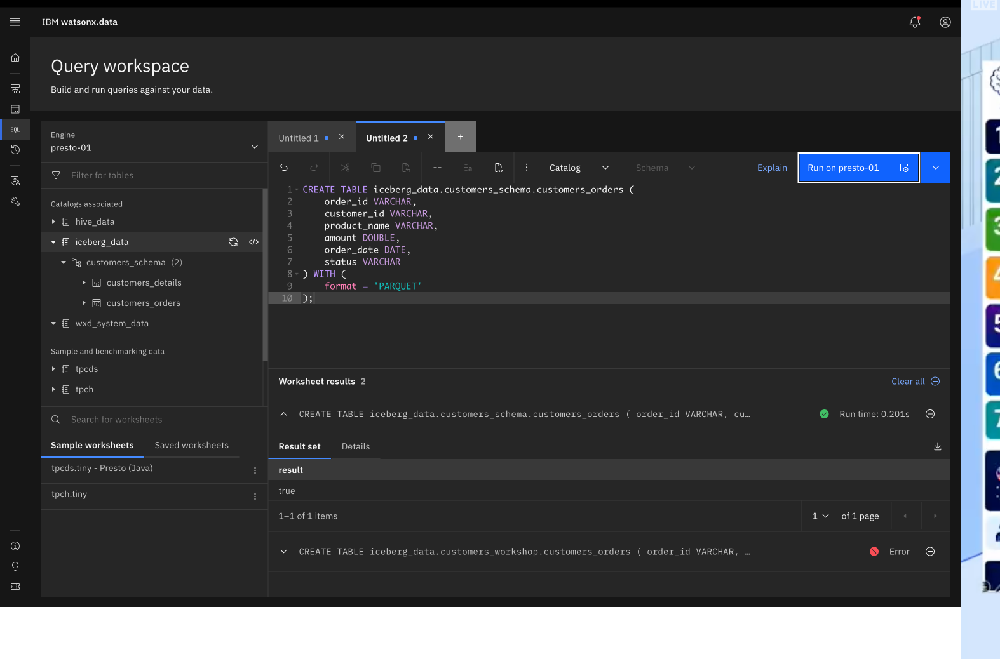

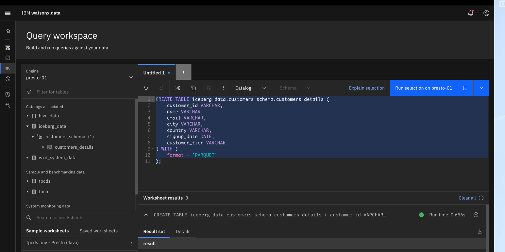

#### 2.3 Insert Data into Iceberg Tables

In the **Query Manager**, populate the Iceberg tables with sample data.

```sql
-- Insert sample customers
INSERT INTO iceberg_data.customers_schema.customers_details VALUES
('C1', 'Arjun Patel', 'arjun@example.com', 'Mumbai', 'India', DATE '2022-01-15', 'Gold'),
('C2', 'Sarah Johnson', 'sarah@example.com', 'New York', 'USA', DATE '2021-06-20', 'Platinum'),
('C3', 'Li Wei', 'liwei@example.com', 'Shanghai', 'China', DATE '2022-03-10', 'Silver'),
('C4', 'Maria Garcia', 'maria@example.com', 'Madrid', 'Spain', DATE '2021-11-05', 'Gold'),
('C5', 'James Smith', 'james@example.com', 'London', 'UK', DATE '2022-02-28', 'Bronze');

-- Insert sample orders
INSERT INTO iceberg_data.customers_schema.customers_orders VALUES
('O001', 'C1', 'Laptop Pro', 1299.99, DATE '2023-01-10', 'Delivered'),
('O002', 'C1', 'Wireless Mouse', 29.99, DATE '2023-02-15', 'Delivered'),
('O003', 'C1', 'USB-C Hub', 49.99, DATE '2023-03-20', 'Delivered'),
('O004', 'C2', 'Monitor 4K', 599.99, DATE '2023-01-25', 'Delivered'),
('O005', 'C2', 'Keyboard Mechanical', 149.99, DATE '2023-02-10', 'Delivered'),
('O006', 'C2', 'Webcam HD', 89.99, DATE '2023-03-05', 'Delivered'),
('O007', 'C3', 'Headphones', 199.99, DATE '2023-02-20', 'Delivered'),
('O008', 'C3', 'Phone Case', 19.99, DATE '2023-03-15', 'Delivered'),
('O009', 'C4', 'Tablet', 499.99, DATE '2023-01-30', 'Delivered'),
('O010', 'C4', 'Stylus Pen', 79.99, DATE '2023-02-25', 'Delivered'),
('O011', 'C5', 'Smart Watch', 299.99, DATE '2023-03-01', 'Delivered');
```

#### 2.4 Verify

```sql
SELECT * from iceberg_data.customers_schema.customers_details;
SELECT * from iceberg_data.customers_schema.customers_orders;
```

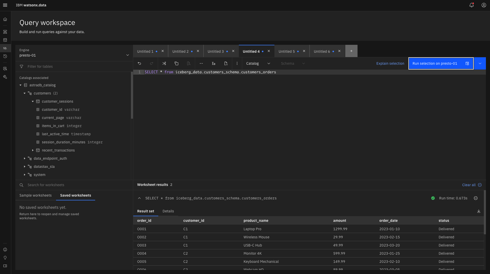

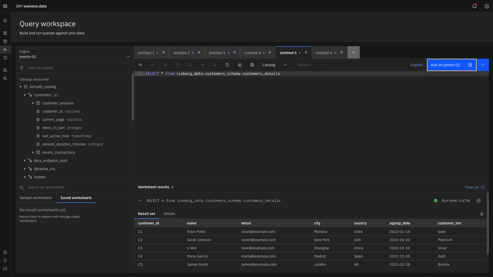

---
### Step 3: Setup AstraDB (Cassandra)

AstraDB is a fully managed Cassandra service from DataStax. We'll use it to store our real time data.

#### 3.1 Create AstraDB Account

1. Navigate to [astra.datastax.com](https://astra.datastax.com)
2. Sign up/Sign in with IBM SSO. Optionally, you can sign in with GitHub account, or Google account.

#### 3.2 Create Database

1. Click **"Create Database"** in the dashboard
2. Select **"Serverless (Non-Vector)"** 
3. Configure your database:
   - **Database name:** `workshop_customers_db`
   - **Keyspace name:** `customers`
   - **Cloud Provider:** AWS ( or your choice)
   - **Region:** (your choice)
4. Click **"Create Database"**
    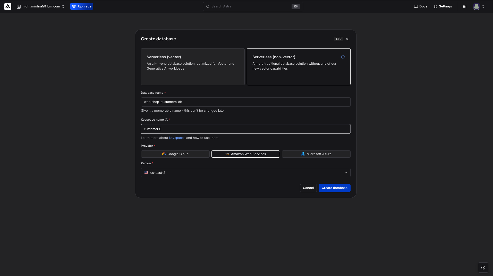
5. Capture the **Database ID** and generate an **Application token** with appropriate roles and tokens.
4. **🔐 CRITICAL** Copy and save the token immediately. You can download this information also.

    


> You will need following credentials in Step 5 for the CQL Proxy setup. Copy them to a secure location:
>
> ```
> 📋 Database ID: <your-database-id>
> 🗂️  Keyspace: customers
> 🔑 Token: <your-application-token>
> ```

---

### Step 4: Populate AstraDB with Sample Data

#### 4.1 Create tables

We will use the `customers` keyspace to store our data. The data will be used by watsonx.data to perform real time queries.

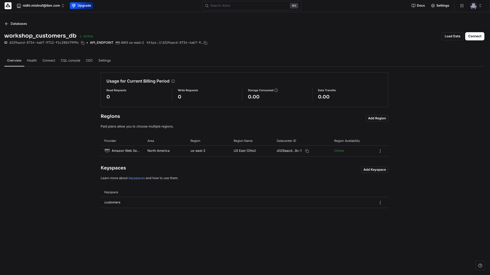

We will create two tables:
    - `customer_sessions` : contains information about customer activity on the shopping website
    - `recent_transactions` : contains information about latest transactions per customer

Go to CQL console and execute the following CQL commands:

```sql
-- Create customer sessions table
CREATE TABLE customers.customer_sessions (
    customer_id TEXT PRIMARY KEY,
    current_page TEXT,
    last_active_time TIMESTAMP,
    session_duration_minutes INT,
    items_in_cart INT
);

-- Create recent transactions table
CREATE TABLE customers.recent_transactions (
    transaction_id TEXT PRIMARY KEY,
    customer_id TEXT,
    amount DOUBLE,
    transaction_time TIMESTAMP,
    status TEXT,
    payment_method TEXT
);
```
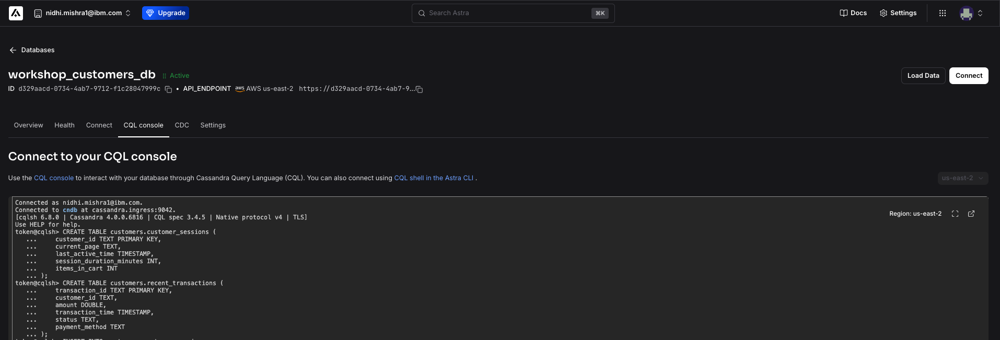

#### 4.2 Insert Sample Data into Cassandra

CQL queries to populate data in tables:

```sql
-- Insert customer sessions
INSERT INTO customers.customer_sessions 
(customer_id, current_page, last_active_time, session_duration_minutes, items_in_cart)
VALUES 
('C1', 'homepage', toTimestamp(now()), 2, 0);

INSERT INTO customers.customer_sessions 
(customer_id, current_page, last_active_time, session_duration_minutes, items_in_cart)
VALUES 
('C2', 'product_page', toTimestamp(now()), 5, 2);

INSERT INTO customers.customer_sessions 
(customer_id, current_page, last_active_time, session_duration_minutes, items_in_cart)
VALUES 
('C3', 'search_results', toTimestamp(now()), 3, 1);

INSERT INTO customers.customer_sessions 
(customer_id, current_page, last_active_time, session_duration_minutes, items_in_cart)
VALUES 
('C4', 'cart', toTimestamp(now()), 8, 4);

INSERT INTO customers.customer_sessions 
(customer_id, current_page, last_active_time, session_duration_minutes, items_in_cart)
VALUES 
('C5', 'checkout', toTimestamp(now()), 10, 3);

INSERT INTO customers.customer_sessions 
(customer_id, current_page, last_active_time, session_duration_minutes, items_in_cart)
VALUES 
('C6', 'product_page', toTimestamp(now()), 6, 1);

INSERT INTO customers.customer_sessions 
(customer_id, current_page, last_active_time, session_duration_minutes, items_in_cart)
VALUES 
('C7', 'homepage', toTimestamp(now()), 1, 0);

-- Insert recent transactions

INSERT INTO customers.recent_transactions 
(transaction_id, customer_id, amount, transaction_time, status, payment_method)
VALUES 
('T1','C1',1500, toTimestamp(now()), 'pending','credit_card');

INSERT INTO customers.recent_transactions 
(transaction_id, customer_id, amount, transaction_time, status, payment_method)
VALUES 
('T2','C2',8000, toTimestamp(now()), 'completed','upi');

INSERT INTO customers.recent_transactions 
(transaction_id, customer_id, amount, transaction_time, status, payment_method)
VALUES 
('T3','C3',1200, toTimestamp(now()), 'failed','debit_card');

INSERT INTO customers.recent_transactions 
(transaction_id, customer_id, amount, transaction_time, status, payment_method)
VALUES 
('T4','C1',2200, toTimestamp(now()), 'completed','net_banking');

INSERT INTO customers.recent_transactions 
(transaction_id, customer_id, amount, transaction_time, status, payment_method) VALUES 
('T5','C4',5000, toTimestamp(now()), 'pending','credit_card');
``` 
#### 4.3 Verify 

```sql

-- Check Keyspaces
DESC keyspaces;

-- Check Tables
DESC tables;

-- View Data in tables
Select * from customers.recent_transactions;
Select * from customers.customer_sessions;
```

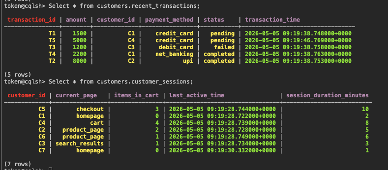

---

### Step 5: Setup CQL Proxy (Bridge to AstraDB)

The CQL Proxy allows watsonx.data to connect to AstraDB using the Cassandra protocol. In this tutorial we will set it up on the watsonx.data VM.


#### 5.1 SSH into watsonx.data VM

Details should be available in the environment details as listed in Section 1.3.

**SSH Access:**
```bash
ssh -p <your-port> watsonx@<your-hostname>
# Password: watsonx.data
```

#### 5.2 Start CQL Proxy Container

Docker is pre-installed on the VM. Run the following command:

🔐 **USE YOUR SAVED CREDENTIALS!**

Replace the placeholders with the values you saved in Step 3.3: 

    <YOUR_ASTRA_TOKEN> → Your AstraDB application token (🔑)
    <YOUR_DATABASE_ID> → Your database ID (📋)

```
docker run -p 9042:9042 datastax/cql-proxy:v0.2.0 --astra-token <YOUR_ASTRA_TOKEN> --astra-database-id <YOUR_DATABASE_ID> --username cassandra --password cassandra
```
If the cql-proxy successfully starts, you'll see output like:
```
{"level":"info","ts":1777982172.0330312,"caller":"proxy/run.go:325","msg":"proxy is listening","address":"[::]:9042"} 
```
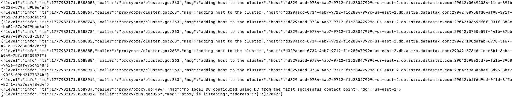

#### 5.3 Get VM IP Address

```
hostname -I
```

> 💾 **SAVE THIS IP ADDRESS!**
> Copy the first IP address from the output (e.g., `192.168.1.100`). ⚠️ **You'll need this in Step 6 to connect Cassandra to watsonx.data.**


#### 5.4 Verify 

In a new terminal window, ssh again in the VM and run these commands to verify:

-- CQL Proxy is Running and Query AstraDB
```
docker ps | grep cql-proxy
```
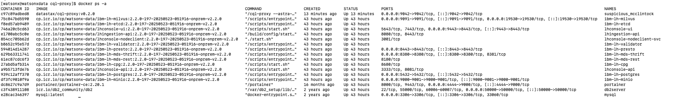


-- Verify if you are able to access AstraDB successfully
```
cqlsh <host-IP> 9042
```

-- You should be able to query the data from AstraDB in this VM now.

```
select * from customers.recent_transactions;
select * from customers.customer_sessions;
```
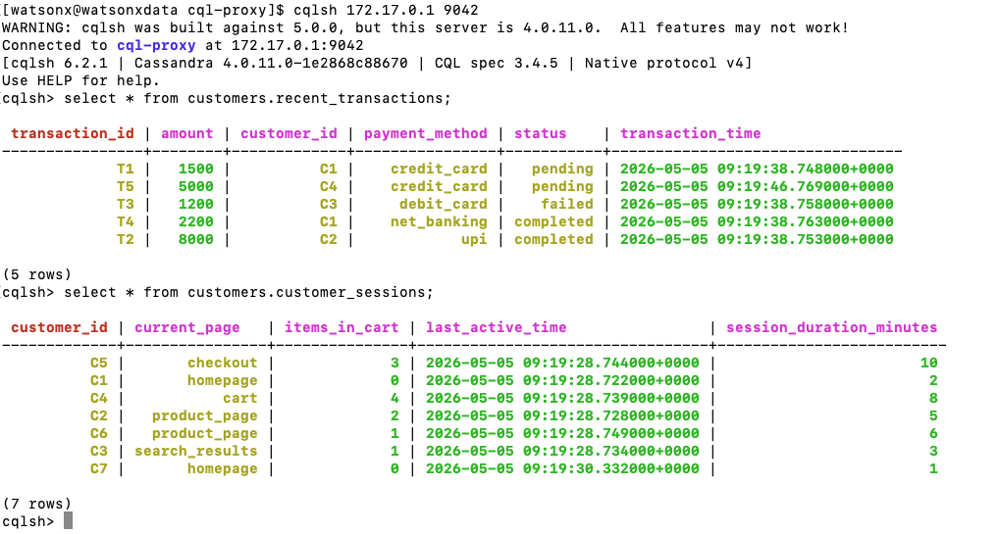

---

### Step 6: Connect Cassandra to watsonx.data

#### 6.1 Access watsonx.data UI

1. Open your browser
2. Navigate to: `https://<your-hostname>:47405`
3. Accept the security warning (self-signed certificate)
4. Login with:
   - **Username:** `ibmlhadmin`
   - **Password:** `password`

#### 6.2 Add Cassandra Catalog

1. In the watsonx.data UI, click **"Infrastructure Manager"** in the left menu
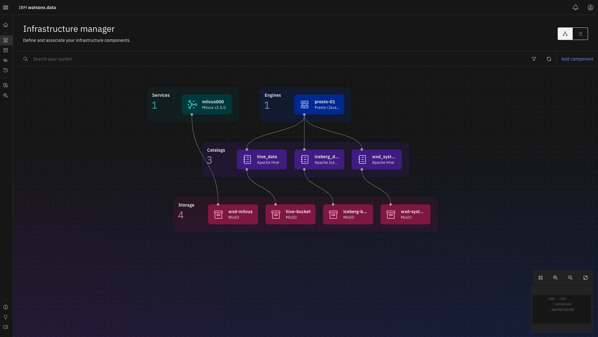

2. Click **"Add Component"** → **"Add Catalog"**
3. Select **"Cassandra"** as the catalog type
4. Fill in the connection details:

> 🔧 **USE YOUR SAVED VM IP ADDRESS!**
>
> Replace `<VM_IP_ADDRESS>` with the IP you saved in Step 5.4:

   ```
  
   Display name: AstraDB
   Hostname: <VM_IP_ADDRESS>  👈 Use the IP from Step 5.4
   Port: 9042
   Username: cassandra
   Password: cassandra
    Catalog name: astradb_catalog
   ```

5. Click **"Test Connection"** to verify
6. If successful, click **"Create"** to add the catalog

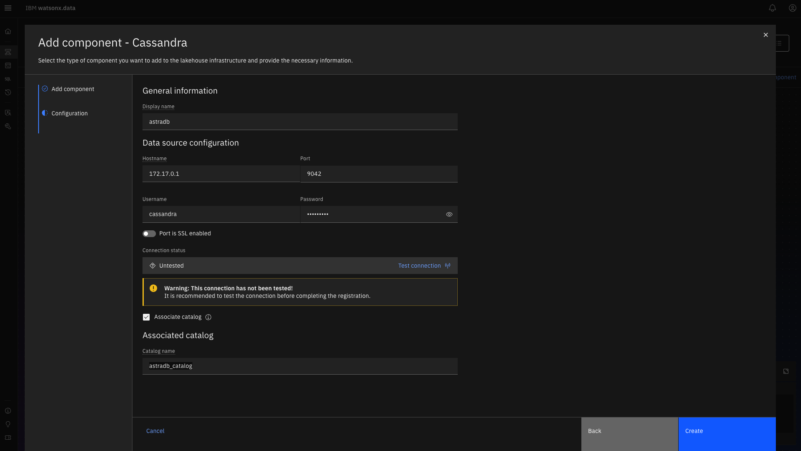


#### 6.3 Associate with Presto Engine

1. Go to **"Infrastructure Manager"**
2. Find your Presto engine
3. Click **"Manage associations"**
4. Check the box next to **"astradb_catalog"** catalog
5. Click **"Save"**

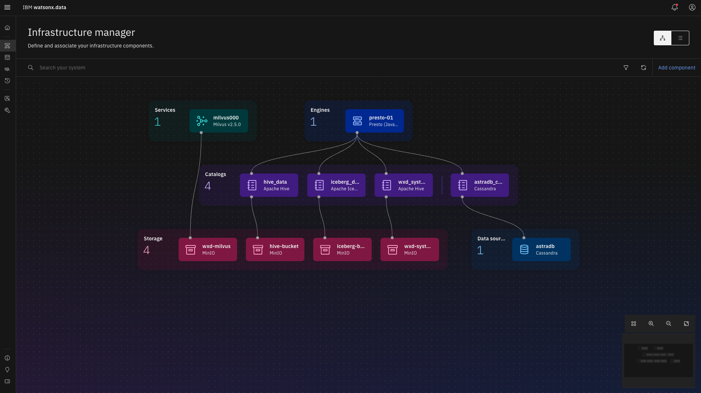

#### 6.4 Verify 

1. Go to **"Query_workspace"**.
2. Query cassandra data using the **"astradb_catalog"** catalog.

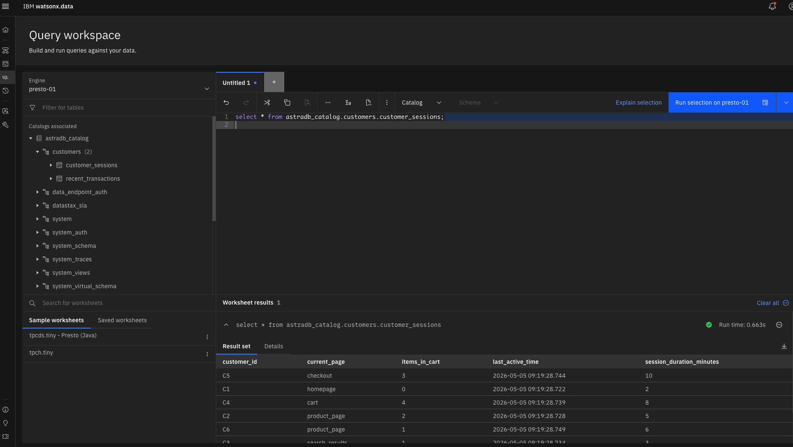


Now we are able to query successfully data from iceberg tables and cassandra tables using Presto Query Engine.

---

## 🎯 Running Federated Queries

Now comes the exciting part - querying both systems together!

### Query 1: Get customer lifetime value with current activity:

```sql
SELECT 
    c.customer_id,
    c.name,
    c.customer_tier,
    SUM(o.amount) AS lifetime_value,
    s.current_page,
    s.items_in_cart,
    s.last_active_time
FROM iceberg_data.customers_schema.customers_details c
JOIN iceberg_data.customers_schema.customers_orders o 
    ON c.customer_id = o.customer_id
LEFT JOIN astradb_catalog.customers.customer_sessions s 
    ON c.customer_id = s.customer_id
GROUP BY 
    c.customer_id, 
    c.name, 
    c.customer_tier,
    s.current_page,
    s.items_in_cart,
    s.last_active_time
ORDER BY lifetime_value DESC;
```

### Query 2: Customer Support Dashboard

Complete view for support agents:

```sql
SELECT 
    c.customer_id,
    c.name,
    c.email,
    c.city,
    c.customer_tier,
    COUNT(o.order_id) AS total_orders,
    SUM(o.amount) AS lifetime_value,
    s.current_page AS current_activity,
    s.session_duration_minutes,
    s.items_in_cart,
    t.transaction_id AS latest_transaction,
    t.amount AS transaction_amount,
    t.status AS transaction_status,
    t.payment_method
FROM iceberg_data.customers_schema.customers_details c
LEFT JOIN iceberg_data.customers_schema.customers_orders o 
    ON c.customer_id = o.customer_id
LEFT JOIN astradb_catalog.customers.customer_sessions s 
    ON c.customer_id = s.customer_id
LEFT JOIN astradb_catalog.customers.recent_transactions t 
    ON c.customer_id = t.customer_id
WHERE c.customer_id = 'C1'
GROUP BY 
    c.customer_id, c.name, c.email, c.city, c.customer_tier,
    s.current_page, s.session_duration_minutes, s.items_in_cart,
    t.transaction_id, t.amount, t.status, t.payment_method;
```

### Query 3: High-Value Customers at Checkout

Identify VIP customers who need immediate attention:

```sql
SELECT 
    c.customer_id,
    c.name,
    c.customer_tier,
    SUM(o.amount) AS lifetime_value,
    s.current_page,
    s.items_in_cart,
    t.status AS transaction_status,
    t.amount AS pending_amount
FROM iceberg_data.customers_schema.customers_details c
JOIN iceberg_data.customers_schema.customers_orders o 
    ON c.customer_id = o.customer_id
JOIN astradb_catalog.customers.customer_sessions s 
    ON c.customer_id = s.customer_id
LEFT JOIN astradb_catalog.customers.recent_transactions t 
    ON c.customer_id = t.customer_id
WHERE s.current_page = 'cart' 
AND c.customer_tier IN ('Gold', 'Platinum')
GROUP BY 
    c.customer_id, c.name, c.customer_tier,
    s.current_page, s.items_in_cart,
    t.status, t.amount
HAVING SUM(o.amount) > 1000;
```

### Query 4: Real-Time Analytics Dashboard

Combine historical trends with current activity:

```sql
SELECT 
    c.customer_tier,
    COUNT(DISTINCT c.customer_id) AS total_customers,
    AVG(order_summary.lifetime_value) AS avg_lifetime_value,
    COUNT(DISTINCT s.customer_id) AS currently_active,
    SUM(s.items_in_cart) AS total_items_in_carts,
    COUNT(DISTINCT CASE WHEN t.status = 'Pending' THEN t.transaction_id END) AS pending_transactions
FROM iceberg_data.customers_schema.customers_details c
LEFT JOIN (
    SELECT customer_id, SUM(amount) AS lifetime_value
    FROM iceberg_data.customers_schema.customers_orders
    GROUP BY customer_id
) order_summary ON c.customer_id = order_summary.customer_id
LEFT JOIN astradb_catalog.customers.customer_sessions s 
    ON c.customer_id = s.customer_id
LEFT JOIN astradb_catalog.customers.recent_transactions t 
    ON c.customer_id = t.customer_id
GROUP BY c.customer_tier
ORDER BY avg_lifetime_value DESC;
```

---

## 💡 What You'll Observe

For each customer query, you'll get a **unified view**:

| Data Type | Source | Information |
|-----------|--------|-------------|
| 💰 **Lifetime Value** | Iceberg | Historical purchase data, total spend |
| 🟢 **Current Activity** | Cassandra | Real-time session, current page, cart items |
| ⚠️ **Transaction Status** | Cassandra | Latest transaction, payment status |
| 👤 **Customer Profile** | Iceberg | Demographics, tier, signup date |

**Key Insight:** All in **one query**, without moving or duplicating data!

---

## 🎯 Key Takeaways

### 1. **Unified Analytics**
- Combine real-time operational data with historical analytical data
- Single SQL interface for both systems
- No need to learn multiple query languages

### 2. **No Data Duplication**
- Query data where it lives
- Avoid complex ETL pipelines
- Reduce storage costs and maintenance

### 3. **Optimal Performance**
- **Cassandra:** Millisecond reads for operational queries
- **Iceberg:** Petabyte-scale analytics with ACID guarantees
- **Presto:** Intelligent query optimization and push-down

### 4. **Perfect for GenAI Applications**
- Rich context for LLM prompts
- Real-time + historical insights
- Enable intelligent decision-making

### 5. **Scalability**
- Cassandra scales horizontally for writes
- Iceberg scales to petabytes on object storage
- Presto distributes queries across clusters

---

## 🤖 Bonus: GenAI Extension

Use the federated query output as context for Large Language Models:

### Example: AI-Powered Customer Support

```python
# Query result from federated query
customer_context = {
    "name": "Arjun Patel",
    "customer_tier": "Gold",
    "lifetime_value": 1379.97,
    "total_orders": 3,
    "current_page": "Checkout",
    "items_in_cart": 2,
    "session_duration": 15,
    "transaction_status": "Pending",
    "pending_amount": 1599.98
}

# LLM Prompt
prompt = f"""
You are an AI customer support assistant.

Customer Profile:
- Name: {customer_context['name']}
- Tier: {customer_context['customer_tier']}
- Lifetime Value: ${customer_context['lifetime_value']}
- Total Orders: {customer_context['total_orders']}

Current Activity:
- Page: {customer_context['current_page']}
- Items in Cart: {customer_context['items_in_cart']}
- Session Duration: {customer_context['session_duration']} minutes

Transaction:
- Status: {customer_context['transaction_status']}
- Amount: ${customer_context['pending_amount']}

Based on this information:
1. What should the support agent prioritize?
2. What proactive assistance can we offer?
3. Are there any concerns or opportunities?
"""

# Send to LLM (OpenAI, watsonx.ai, etc.)
# response = llm.generate(prompt)
```

**Sample LLM Response:**
```
Priority Actions:
1. IMMEDIATE: Customer has a pending high-value transaction ($1,599.98) 
   at checkout. Proactively reach out to assist with any payment issues.

2. This is a Gold-tier customer with strong lifetime value ($1,379.97). 
   Ensure VIP treatment and consider offering:
   - Free expedited shipping
   - Extended warranty
   - Loyalty points bonus

3. Customer has been on checkout page for 15 minutes with 2 items in cart.
   Possible friction points:
   - Payment processing issue
   - Shipping cost concerns
   - Promo code questions

Recommended Actions:
- Send proactive chat: "Hi Arjun! I see you're checking out. Need any help?"
- Offer 10% discount code for Gold members
- Highlight free shipping threshold
- Provide direct support line for immediate assistance
```

### Integration with watsonx.ai

```python
from ibm_watson_machine_learning import APIClient

# Initialize watsonx.ai client
wml_credentials = {
    "url": "https://us-south.ml.cloud.ibm.com",
    "apikey": "YOUR_API_KEY"
}

client = APIClient(wml_credentials)

# Use foundation model
model_id = "ibm/granite-13b-chat-v2"

# Generate response
response = client.foundation_models.generate(
    model_id=model_id,
    prompt=prompt,
    params={
        "max_new_tokens": 500,
        "temperature": 0.7
    }
)

print(response['results'][0]['generated_text'])
```

---

## 🧩 Extensions and Next Steps

### 1. **Streaming Data Ingestion**
Add real-time data pipelines:
```
Kafka → Cassandra (real-time events)
Spark Streaming → Iceberg (micro-batches)
```

### 2. **BI Tool Integration**
Connect business intelligence tools:
- **Tableau:** Connect via Presto JDBC
- **Apache Superset:** Native Presto support
- **Power BI:** Use Presto connector

### 3. **Advanced Analytics**
- Machine learning on historical data (Iceberg)
- Real-time scoring with operational data (Cassandra)
- Feature stores combining both

### 4. **Data Governance**
- Implement data quality checks
- Add data lineage tracking
- Set up access controls and policies

### 5. **Production Deployment**
- Deploy on IBM Cloud, AWS, or GCP
- Set up high availability
- Implement monitoring and alerting
- Configure auto-scaling

### 6. **AI Workflow Integration**
- Connect to Langflow for visual AI workflows
- Build RAG (Retrieval Augmented Generation) applications
- Create AI agents with real-time context


---


### Monitoring Queries

Access Presto UI to monitor query performance:
```
https://<your-hostname>:21950
```

Check:
- Query execution time
- Data scanned
- Memory usage
- Stage details

---

## 🔧 Troubleshooting Guide

### Common Issues and Solutions

#### Issue 1: AstraDB Catalog not populating
**Symptoms:** No tables appear in the catalog
**Solution:**
1. Go to Infrastrcuture Manager -> Data Source -> AstraDB 
2. Update credentials. username = cassandra and password = cassandra


---

## 📚 Additional Resources

### Documentation
- [watsonx.data Documentation](https://www.ibm.com/docs/en/watsonxdata)
- [AstraDB Documentation](https://docs.datastax.com/en/astra/home/astra.html)
- [Apache Iceberg Documentation](https://iceberg.apache.org/docs/latest/)
- [Presto Documentation](https://prestodb.io/docs/current/)
- [Cassandra Documentation](https://cassandra.apache.org/doc/latest/)

### Tutorials
- [Cassandra Data Modeling Best Practices](https://cassandra.apache.org/doc/latest/data_modeling/)
- [Iceberg Table Format Specification](https://iceberg.apache.org/spec/)
- [Presto SQL Reference](https://prestodb.io/docs/current/sql.html)
- [watsonx.data Getting Started](https://www.ibm.com/docs/en/watsonxdata/2.0.x?topic=started-getting)

### Community
- [watsonx Community](https://community.ibm.com/community/user/watsonx/home)
- [DataStax Community](https://community.datastax.com/)
- [Apache Iceberg Slack](https://apache-iceberg.slack.com/)
- [Presto Slack](https://prestodb.io/slack.html)

### Videos
- [watsonx.data Overview](https://www.youtube.com/watch?v=watsonx-data)
- [AstraDB Quickstart](https://www.youtube.com/watch?v=astradb-quickstart)
- [Lakehouse Architecture Explained](https://www.youtube.com/watch?v=lakehouse-arch)

---

## 🤝 Contributing

We welcome contributions to improve this workshop!

### How to Contribute

1. Fork the repository
2. Create a feature branch (`git checkout -b feature/improvement`)
3. Make your changes
4. Test thoroughly
5. Commit your changes (`git commit -am 'Add new feature'`)
6. Push to the branch (`git push origin feature/improvement`)
7. Create a Pull Request

### Contribution Ideas

- Add new use cases
- Improve documentation
- Add more sample queries
- Create visualization examples
- Add troubleshooting tips
- Translate to other languages

---

## 📝 License

This workshop is licensed under the **MIT License**.

```
MIT License

Copyright (c) 2024 [Your Name/Organization]

Permission is hereby granted, free of charge, to any person obtaining a copy
of this software and associated documentation files (the "Software"), to deal
in the Software without restriction, including without limitation the rights
to use, copy, modify, merge, publish, distribute, sublicense, and/or sell
copies of the Software, and to permit persons to whom the Software is
furnished to do so, subject to the following conditions:

The above copyright notice and this permission notice shall be included in all
copies or substantial portions of the Software.

THE SOFTWARE IS PROVIDED "AS IS", WITHOUT WARRANTY OF ANY KIND, EXPRESS OR
IMPLIED, INCLUDING BUT NOT LIMITED TO THE WARRANTIES OF MERCHANTABILITY,
FITNESS FOR A PARTICULAR PURPOSE AND NONINFRINGEMENT. IN NO EVENT SHALL THE
AUTHORS OR COPYRIGHT HOLDERS BE LIABLE FOR ANY CLAIM, DAMAGES OR OTHER
LIABILITY, WHETHER IN AN ACTION OF CONTRACT, TORT OR OTHERWISE, ARISING FROM,
OUT OF OR IN CONNECTION WITH THE SOFTWARE OR THE USE OR OTHER DEALINGS IN THE
SOFTWARE.
```

---

## 👥 Authors and Acknowledgments

### Authors
- **Nidhi Mishra** - Initial work and workshop design
