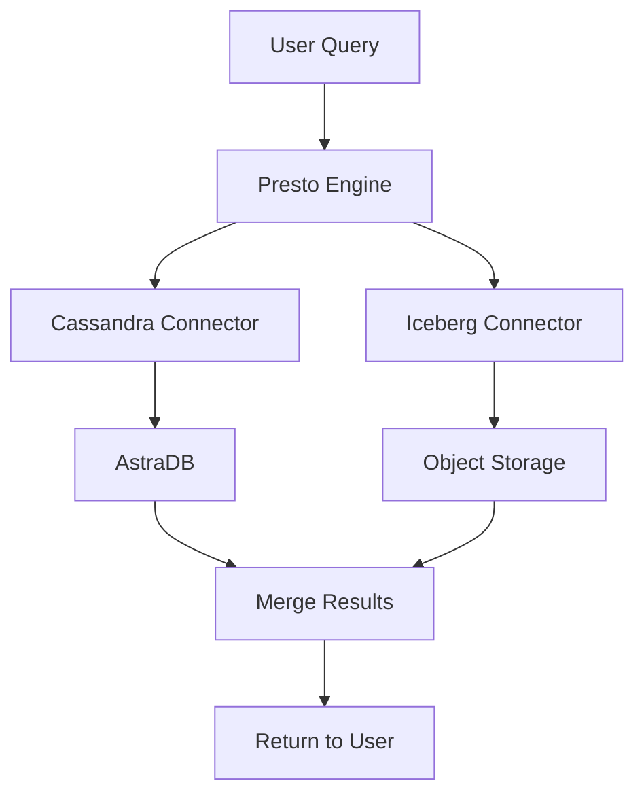

# Image Guide for Workshop

This guide lists all the images needed for the workshop and where to place them.

## 📁 Directory Structure

```
assets/
├── screenshots/          # UI screenshots from various tools
├── diagrams/            # Architecture and flow diagrams
├── icons/               # Icons and logos
└── IMAGE_GUIDE.md       # This file
```

## 🖼️ Required Images

### 1. Banner and Branding

#### `banner.png` (1200x400px)
- **Location:** `assets/banner.png`
- **Description:** Workshop banner with title and logos
- **Content:** 
  - Title: "Real-Time + Lakehouse Analytics Workshop"
  - Logos: watsonx.data, AstraDB, Presto, Apache Iceberg
- **Used in:** README.md header

#### `architecture-overview.png` (1000x800px)
- **Location:** `assets/diagrams/architecture-overview.png`
- **Description:** High-level architecture diagram
- **Content:**
  - watsonx.data platform
  - Presto query engine
  - Cassandra/AstraDB (real-time)
  - Iceberg tables (historical)
  - Data flow arrows
- **Used in:** Architecture section

---

## 📸 Screenshots Needed

### TechZone Provisioning

#### `techzone-collection.png`
- **Location:** `assets/screenshots/techzone-collection.png`
- **Description:** TechZone collection page
- **Capture:** IBM watsonx.data Developer Base Image collection page
- **Highlight:** "Environments" tab and "IBM Cloud environment" button

#### `techzone-reservation.png`
- **Location:** `assets/screenshots/techzone-reservation.png`
- **Description:** Reservation form
- **Capture:** Reservation details form
- **Highlight:** Name, Purpose, Geography fields

#### `techzone-ready.png`
- **Location:** `assets/screenshots/techzone-ready.png`
- **Description:** Ready reservation with published services
- **Capture:** Reservation page showing Status: Ready and Published Services
- **Highlight:** SSH, watsonx.data UI, Presto UI URLs

---

### AstraDB Setup

#### `astradb-signup.png`
- **Location:** `assets/screenshots/astradb-signup.png`
- **Description:** AstraDB sign-up page
- **Capture:** astra.datastax.com landing page
- **Highlight:** Sign-up options (GitHub, Google, Email)

#### `astradb-create-database.png`
- **Location:** `assets/screenshots/astradb-create-database.png`
- **Description:** Create database form
- **Capture:** Database creation form
- **Highlight:** Database name, Keyspace, Provider, Region fields

#### `astradb-database-active.png`
- **Location:** `assets/screenshots/astradb-database-active.png`
- **Description:** Active database dashboard
- **Capture:** Database dashboard showing "Active" status
- **Highlight:** Status indicator and Connect tab

#### `astradb-generate-token.png`
- **Location:** `assets/screenshots/astradb-generate-token.png`
- **Description:** Token generation page
- **Capture:** Application Tokens section
- **Highlight:** "Generate Token" button and token display

#### `astradb-token-created.png`
- **Location:** `assets/screenshots/astradb-token-created.png`
- **Description:** Generated token with warning
- **Capture:** Token display with copy button
- **Highlight:** Token value and "won't be shown again" warning

#### `astradb-cql-console.png`
- **Location:** `assets/screenshots/astradb-cql-console.png`
- **Description:** CQL Console interface
- **Capture:** CQL Console with sample query
- **Highlight:** Query editor and results pane

---

### watsonx.data UI

#### `watsonx-login.png`
- **Location:** `assets/screenshots/watsonx-login.png`
- **Description:** watsonx.data login page
- **Capture:** Login screen
- **Highlight:** Username and password fields

#### `watsonx-dashboard.png`
- **Location:** `assets/screenshots/watsonx-dashboard.png`
- **Description:** Main dashboard
- **Capture:** watsonx.data main dashboard
- **Highlight:** Navigation menu on left

#### `watsonx-infrastructure-manager.png`
- **Location:** `assets/screenshots/watsonx-infrastructure-manager.png`
- **Description:** Infrastructure Manager view
- **Capture:** Infrastructure Manager showing engines and catalogs
- **Highlight:** "Add Component" button

#### `watsonx-add-catalog.png`
- **Location:** `assets/screenshots/watsonx-add-catalog.png`
- **Description:** Add Catalog dialog
- **Capture:** Add Catalog form with Cassandra selected
- **Highlight:** Catalog type dropdown and connection fields

#### `watsonx-cassandra-connection.png`
- **Location:** `assets/screenshots/watsonx-cassandra-connection.png`
- **Description:** Cassandra connection details
- **Capture:** Filled Cassandra connection form
- **Highlight:** Hostname, Port, Username, Password fields

#### `watsonx-test-connection.png`
- **Location:** `assets/screenshots/watsonx-test-connection.png`
- **Description:** Successful connection test
- **Capture:** "Test Connection" success message
- **Highlight:** Green checkmark or success indicator

#### `watsonx-manage-associations.png`
- **Location:** `assets/screenshots/watsonx-manage-associations.png`
- **Description:** Catalog associations
- **Capture:** Manage associations dialog
- **Highlight:** Cassandra catalog checkbox

#### `watsonx-query-workspace.png`
- **Location:** `assets/screenshots/watsonx-query-workspace.png`
- **Description:** Query Workspace interface
- **Capture:** Query editor with sample query
- **Highlight:** Query editor, catalog browser, results pane

---

### Presto UI

#### `presto-ui-dashboard.png`
- **Location:** `assets/screenshots/presto-ui-dashboard.png`
- **Description:** Presto UI main page
- **Capture:** Presto UI showing running queries
- **Highlight:** Query list and statistics

#### `presto-query-editor.png`
- **Location:** `assets/screenshots/presto-query-editor.png`
- **Description:** Query editor
- **Capture:** Query editor with federated query
- **Highlight:** SQL query and execute button

#### `presto-query-results.png`
- **Location:** `assets/screenshots/presto-query-results.png`
- **Description:** Query results
- **Capture:** Results of federated query
- **Highlight:** Result table with data from both sources

#### `presto-query-plan.png`
- **Location:** `assets/screenshots/presto-query-plan.png`
- **Description:** Query execution plan
- **Capture:** EXPLAIN output showing query plan
- **Highlight:** Stages and data sources

---

### Terminal/CLI Screenshots

#### `ssh-connection.png`
- **Location:** `assets/screenshots/ssh-connection.png`
- **Description:** SSH connection to VM
- **Capture:** Terminal showing successful SSH connection
- **Highlight:** SSH command and welcome message

#### `docker-cql-proxy.png`
- **Location:** `assets/screenshots/docker-cql-proxy.png`
- **Description:** CQL Proxy container running
- **Capture:** Terminal showing docker run command and docker ps output
- **Highlight:** Container status and port mapping

#### `hostname-ip.png`
- **Location:** `assets/screenshots/hostname-ip.png`
- **Description:** VM IP address
- **Capture:** Terminal showing hostname -I output
- **Highlight:** IP address

---

## 📊 Diagrams Needed

### Architecture Diagrams

#### `architecture-detailed.png` (1200x900px)
- **Location:** `assets/diagrams/architecture-detailed.png`
- **Description:** Detailed architecture with all components
- **Content:**
  - watsonx.data platform box
  - Presto engine with connectors
  - AstraDB with CQL Proxy
  - MinIO/S3 with Iceberg tables
  - Data flow arrows
  - Component labels

#### `data-flow.png` (1000x600px)
- **Location:** `assets/diagrams/data-flow.png`
- **Description:** Data flow for federated queries
- **Content:**
  - Query input
  - Presto processing
  - Parallel data fetch from Cassandra and Iceberg
  - Result aggregation
  - Query output

#### `lakehouse-concept.png` (800x600px)
- **Location:** `assets/diagrams/lakehouse-concept.png`
- **Description:** Lakehouse architecture concept
- **Content:**
  - Traditional data lake vs data warehouse
  - Lakehouse combining both
  - Benefits listed

---

### Flow Diagrams

#### `setup-flow.png` (600x800px)
- **Location:** `assets/diagrams/setup-flow.png`
- **Description:** Setup process flowchart
- **Content:**
  - Step-by-step setup flow
  - Decision points
  - Success/failure paths

#### `query-execution-flow.png` (800x600px)
- **Location:** `assets/diagrams/query-execution-flow.png`
- **Description:** Query execution flow
- **Content:**
  - SQL query submission
  - Presto parsing
  - Connector routing
  - Data retrieval
  - Result merging

---

## 🎨 Icons and Logos

#### `watsonx-logo.png` (200x200px)
- **Location:** `assets/icons/watsonx-logo.png`
- **Description:** watsonx.data logo
- **Source:** IBM brand assets

#### `astradb-logo.png` (200x200px)
- **Location:** `assets/icons/astradb-logo.png`
- **Description:** DataStax AstraDB logo
- **Source:** DataStax brand assets

#### `presto-logo.png` (200x200px)
- **Location:** `assets/icons/presto-logo.png`
- **Description:** Presto logo
- **Source:** Presto project

#### `iceberg-logo.png` (200x200px)
- **Location:** `assets/icons/iceberg-logo.png`
- **Description:** Apache Iceberg logo
- **Source:** Apache Iceberg project

#### `cassandra-logo.png` (200x200px)
- **Location:** `assets/icons/cassandra-logo.png`
- **Description:** Apache Cassandra logo
- **Source:** Apache Cassandra project

---

## 🎯 Use Case Diagrams

#### `customer-support-dashboard.png` (1000x700px)
- **Location:** `assets/diagrams/customer-support-dashboard.png`
- **Description:** Customer support dashboard mockup
- **Content:**
  - Customer profile section
  - Lifetime value chart
  - Current activity panel
  - Transaction status
  - Support actions

#### `genai-integration.png` (800x600px)
- **Location:** `assets/diagrams/genai-integration.png`
- **Description:** GenAI integration architecture
- **Content:**
  - Federated query results
  - LLM processing
  - Context enrichment
  - AI-powered recommendations

---

## 📝 How to Add Images

### Option 1: Create Diagrams with Tools

**Recommended Tools:**
- **Draw.io / diagrams.net** - Free, web-based
- **Lucidchart** - Professional diagrams
- **Excalidraw** - Hand-drawn style
- **Mermaid** - Code-based diagrams (can be embedded in markdown)

### Option 2: Take Screenshots

**Best Practices:**
1. Use high resolution (at least 1920x1080)
2. Crop to relevant area
3. Add annotations/highlights using:
   - macOS: Preview or Skitch
   - Windows: Snipping Tool or Greenshot
   - Cross-platform: GIMP, Photoshop

### Option 3: Use Mermaid Diagrams (Embedded)

For simple diagrams, you can use Mermaid syntax directly in markdown:



---

## 🔄 Image Optimization

Before adding images, optimize them:

1. **Compress images:**
   ```bash
   # Using ImageMagick
   convert input.png -quality 85 -resize 1200x output.png
   
   # Using online tools
   # - TinyPNG (https://tinypng.com/)
   # - Squoosh (https://squoosh.app/)
   ```

2. **Recommended formats:**
   - Screenshots: PNG (lossless)
   - Diagrams: PNG or SVG (vector)
   - Photos: JPEG (compressed)

3. **File size limits:**
   - Keep individual images under 500KB
   - Total assets folder under 10MB

---

## 📋 Checklist

Use this checklist to track image creation:

### Priority 1 (Essential)
- [ ] banner.png
- [ ] architecture-overview.png
- [ ] astradb-create-database.png
- [ ] astradb-generate-token.png
- [ ] watsonx-add-catalog.png
- [ ] watsonx-query-workspace.png
- [ ] presto-query-results.png

### Priority 2 (Important)
- [ ] techzone-reservation.png
- [ ] astradb-database-active.png
- [ ] watsonx-cassandra-connection.png
- [ ] docker-cql-proxy.png
- [ ] architecture-detailed.png
- [ ] data-flow.png

### Priority 3 (Nice to Have)
- [ ] All logos
- [ ] Customer support dashboard mockup
- [ ] GenAI integration diagram
- [ ] Query execution flow
- [ ] Setup flow diagram

---

## 🚀 Quick Start

1. **Create placeholder images:**
   ```bash
   cd assets
   # Create placeholder files
   touch banner.png
   touch diagrams/architecture-overview.png
   touch screenshots/astradb-create-database.png
   ```

2. **Add to README:**
   ```markdown
   
   ```

3. **Replace placeholders with actual images as you create them**

---

## 📞 Need Help?

- **Design resources:** Canva, Figma (free tiers available)
- **Icon libraries:** Font Awesome, Material Icons
- **Stock photos:** Unsplash, Pexels (free)
- **Diagram templates:** Available in Draw.io template gallery

---

*Last Updated: 2024*